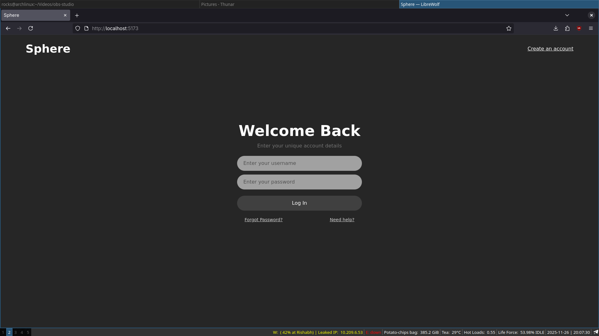
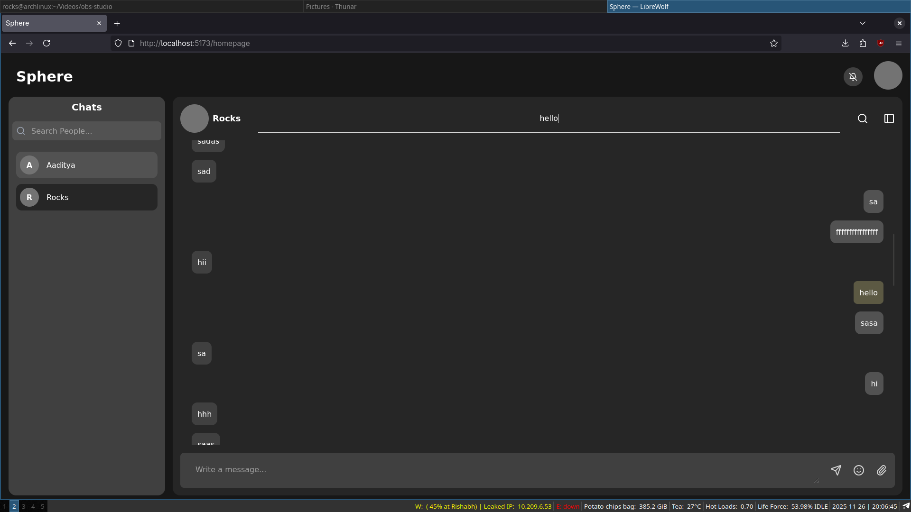
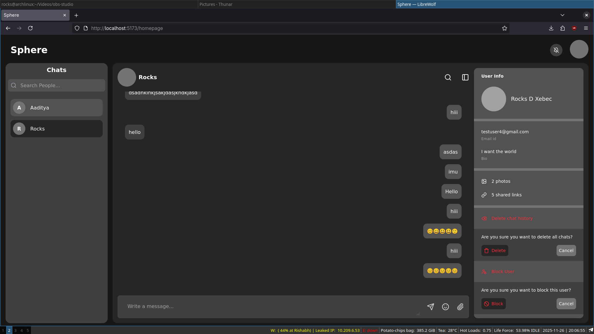
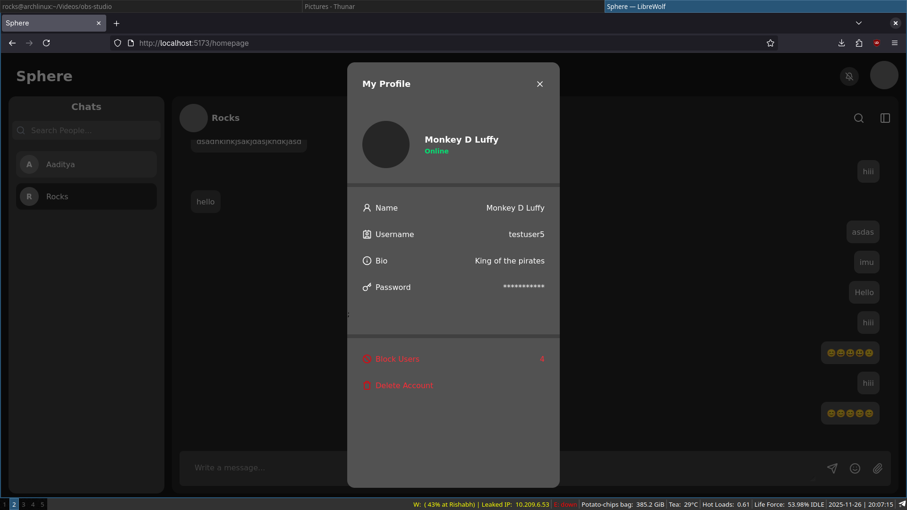
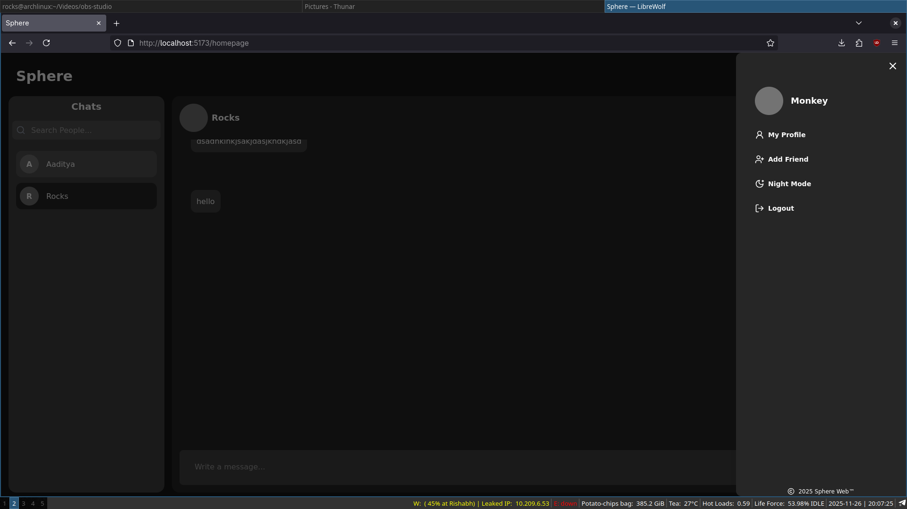

# Sphere


This Project aims to build a open source, private and secure chat app that can run totally on your individual machine with as minimum configuration as possible.
You can run the server for this chatapp on you local machine, add a domain of your own choice and share it with the people you want to connect. 
The database will be available only on your local machine, all userInfo and chats are fully encrypted.


## The Tech stack used for this project are: 
**Frontend: React, TailwindCSS**

**Backend: Spring Boot**

**Database: Postgresql**

## Project Details
WebSocket, RabbitMQ has been used for realtime msg delivery

Spring Security has been used for Authentication

Bcrypt encode has been used for hashing Userd data, however this is subjected to change in near future

**The project is in its very early phase, however you can still clone the repo and run it on your local machine and track the progress**

**To run this application, you need the following packages installed on your system**

**Jdk version 21**

**npm version 11.6.1**

**Postgresql version 18.1**

**Warning: This method has been tested only in linux environment, it might require a few tweaks to run it on other Operating systems**

**Clone the repository**
```bash
git clone https://github.com/Aaditya1611/sphere-project.git
```

Since the backend and frontend code are kept completely in separate folders for now, You need to manually run them in your terminal shell

**To run the frontend code, open the terminal shell and run the following commands** 
```bash
cd sphere-project
cd sphere-frontend
npm install
npm run dev
```
**To run the backend code, open another terminal shell and move to sphere-project directory**

```bash
cd sphere-backend
chmod +x mvnw
./mvnw clean package
./mnvw spring-boot:run
```

**You need to create a .env.local file in the sphere-frontend directory and put the url where your spring-boot backend is running as such:**
```bash
VITE_API_URL = "http://localhost:8080"
## By default the spring-boot applications run on port 8080
```

You can then use a browser to visit the login page at ** http://localhost:5173/ **.

## Demo 

<p align="center">
  
  
  
  
  
</p>

👉 **[Click here to watch a Demo on YouTube](https://youtu.be/h8MMjJNlAHQ)**


## Note
**I need more active contributors to work on this project, so if you are interested, you are welcome to join**

**You can reach out to me via this email id: Aadityaraj1611@gmail.com** 


